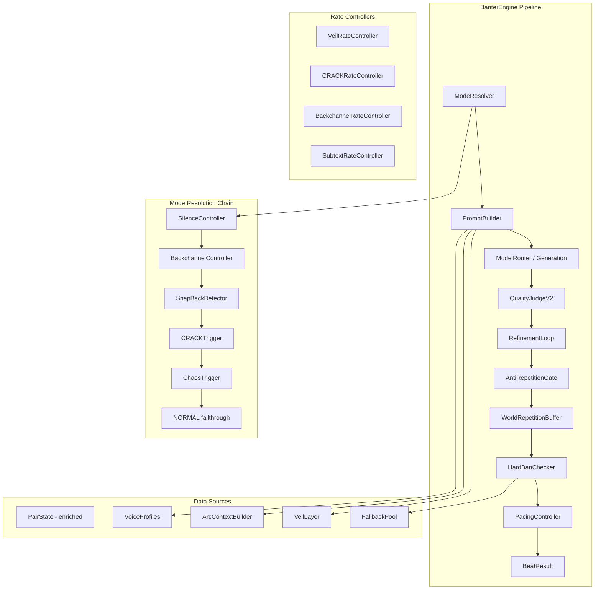
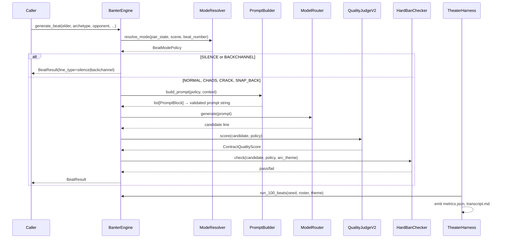

# Design: Banter Legendary Contract Alignment

## Overview

This design forces the banter engine runtime to obey a hard contract defined in the requirements. The gap between spec and runtime is the core problem: modules exist but aren't wired correctly, fields exist in tests but not production state, and prompt assembly happens ad hoc rather than through a structured, validated pipeline.

The design addresses 12 contract sections by:

1. Replacing ad hoc `_build_prompt()` string assembly with a structured `PromptBlock` pipeline that validates marker order and token budgets.
2. Introducing a `BeatMode` enum and `BeatModePolicy` dataclass with a deterministic mode resolution chain that runs before prompt construction.
3. Enriching production `PairState` with fields required by CRACK/snap-back triggers.
4. Aligning the Quality Judge to 6 dimensions (dropping `shareability`, renaming `thematic_relevance` → `pressure_relevance`).
5. Adding `HardBanChecker` as the final gate before delivery.
6. Promoting backchannels and silence to first-class beat events with proper `BeatResult` metadata.
7. Replacing scattered `random.random() < X` calls with deterministic sliding-window rate controllers.
8. Building a 100-beat theater harness with metrics, golden transcripts, and CI gating.

The runtime target is 9.9/10 fidelity against the contract. The proof is the theater harness, not unit tests alone.

---

## Architecture

### Component Diagram



### Data Flow (Single Beat)



---

## Components and Interfaces

### 1. ModeResolver

**Module:** `runtime/src/banter/mode_resolver.py`

**Responsibility:** Determines the active `BeatMode` for the current beat using strict precedence ordering. Runs before prompt construction.

```python
class ModeResolver:
    def __init__(
        self,
        silence_controller: SilenceController,
        backchannel_controller: BackchannelController,
        crack_rate_controller: SlidingWindowController,
    ) -> None: ...

    def resolve(
        self,
        elder: str,
        opponent: str | None,
        pair_state: PairState | None,
        scene_data: SceneContextData,
        beat_number: int,
        prev_mode: BeatMode | None,
        prev_elder_mode: BeatMode | None,
        opponent_last_score: int | None,
    ) -> BeatModePolicy: ...
```

### 2. PromptBuilder (Sacred)

**Module:** `runtime/src/banter/prompt_builder.py`

**Responsibility:** Assembles `PromptBlock` objects in canonical order (Section 1), validates marker sequence, enforces token budgets, and rejects unmarked content.

```python
class SacredPromptBuilder:
    CANONICAL_ORDER: list[str] = [
        "[MODE]", "[ARCHETYPE]", "[ARC]", "[REACT]", "[EMOTIONAL]",
        "[CALLBACK]", "[SCENE]", "[MOVE]", "[BANNED]", "[RHYTHM]",
    ]

    def build(
        self,
        policy: BeatModePolicy,
        archetype: str,
        arc_pressure: str,
        react_block: str | None,
        emotional_block: str | None,
        callback_block: str | None,
        scene_block: str,
        move_block: str,
        banned_block: str,
        rhythm_block: str | None,
    ) -> str: ...

    def validate_order(self, blocks: list[PromptBlock]) -> None: ...
    def validate_budgets(self, blocks: list[PromptBlock]) -> None: ...
```

### 3. QualityJudgeV2

**Module:** `runtime/src/banter/quality_judge.py` (refactored)

**Responsibility:** Scores candidates on 6 dimensions, enforces emotional_texture hard block, emits `clip_candidate` flag.

```python
class QualityJudgeV2:
    async def score(
        self,
        candidate: str,
        *,
        archetype: str,
        move: str,
        arc_theme: str,
        policy: BeatModePolicy,
        scene_context: SceneContextData | None = None,
    ) -> ContractQualityScore: ...
```

### 4. HardBanChecker

**Module:** `runtime/src/banter/hard_bans.py`

**Responsibility:** Final gate before delivery. Rejects (not refines) any line violating the 7 mandatory bans.

```python
class HardBanChecker:
    def check(
        self,
        candidate: str,
        *,
        policy: BeatModePolicy,
        arc_theme_title: str,
        archetype: str,
    ) -> HardBanVerdict: ...
```

### 5. SlidingWindowController

**Module:** `runtime/src/banter/rate_controllers.py`

**Responsibility:** Deterministic rate limiting. Replaces `random.random() < X` for contract-critical features.

```python
class SlidingWindowController:
    def __init__(self, max_count: int, window_size: int) -> None: ...
    def allow(self, key: str) -> bool: ...
    def record(self, key: str) -> None: ...
    def reset(self, key: str) -> None: ...
```

### 6. TheaterHarness

**Module:** `runtime/src/banter/theater_harness.py`

**Responsibility:** Runs 100-beat fixed-seed sessions, emits transcript, metrics JSON, prompt snapshots, and delivered line events.

```python
class TheaterHarness:
    async def run(
        self,
        seed: int,
        roster: list[ArchetypeRoster],
        arc_theme: str,
        starting_pairs: dict[str, PairState],
        model_stub: ModelStub | None = None,
    ) -> HarnessResult: ...
```

### 7. BackchannelController (upgraded)

**Module:** `runtime/src/banter/backchannel.py` (refactored)

**Responsibility:** Produces first-class `BeatResult` with `line_type="backchannel"`, 2-6 words, short delay, hard bans applied.

### 8. SilenceController

**Module:** `runtime/src/banter/silence_controller.py`

**Responsibility:** Produces first-class `BeatResult` with `line_type="silence"`, no quality score, 3-5 second pacing.

---

## Data Models

### BeatMode Enum

```python
from enum import Enum

class BeatMode(Enum):
    NORMAL = "normal"
    CHAOS = "chaos"
    CRACK = "crack"
    SNAP_BACK = "snap_back"
    BACKCHANNEL = "backchannel"
    SILENCE = "silence"
```

### BeatModePolicy

```python
@dataclass(frozen=True)
class BeatModePolicy:
    mode: BeatMode
    quality_threshold: int | None       # None for BACKCHANNEL/SILENCE
    refinement_allowed: bool
    anti_repetition_enabled: bool
    hard_bans_enabled: bool
    word_count_min: int
    word_count_max: int
    move_override: str | None           # e.g. "ESCALATE" for CHAOS
    pacing_min_s: float = 1.0
    pacing_max_s: float = 10.0
```

**Policy table:**

| Mode | quality_threshold | refinement | anti_rep | hard_bans | word_min | word_max | move_override |
|------|------------------:|:----------:|:--------:|:---------:|:--------:|:--------:|:-------------:|
| NORMAL | 9 | ✓ | ✓ | ✓ | 4 | 30 | None |
| CHAOS | 6 | ✗ | ✗ | ✓ | 4 | 30 | ESCALATE(75%)/TAUNT(25%) |
| CRACK | 5 | ✗ | ✓ | ✓ | 4 | 20 | None |
| SNAP_BACK | 8 | ✓ | ✓ | ✓ | 4 | 30 | None |
| BACKCHANNEL | None | ✗ | ✗ | ✓ | 2 | 6 | None |
| SILENCE | None | ✗ | ✗ | ✗ | 0 | 0 | None |

### PromptBlock

```python
@dataclass(frozen=True)
class PromptBlock:
    marker: str        # e.g. "[MODE]", "[ARCHETYPE]"
    text: str          # block content (without marker prefix)
    max_tokens: int    # token budget ceiling
```

### PairState (enriched)

```python
@dataclass
class PairState:
    tension_level: int                  # clamped [0, 10]
    last_interaction_ts: float
    reconciliation_arc: bool = False
    reconciliation_remaining: int = 0
    peak_tension_summary: str = ""
    # --- New fields for CRACK/snap-back (Section 8) ---
    recent_betrayal: bool = False
    last_wound_summary: str = ""
    trust_delta: float = 0.0
    consecutive_escalations: int = 0
    consecutive_counters: int = 0
```

### ContractQualityScore

```python
@dataclass(frozen=True)
class ContractQualityScore:
    sharpness: int              # 0-3
    emotional_texture: int      # 0-3
    rhythm: int                 # 0-3
    pressure_relevance: int     # 0-3 (renamed from thematic_relevance)
    voice_authenticity: int     # 0-3
    subtext_depth: int          # 0-3

    @property
    def total(self) -> int:
        """Combined score (0-18)."""
        return (
            self.sharpness + self.emotional_texture + self.rhythm
            + self.pressure_relevance + self.voice_authenticity + self.subtext_depth
        )

    @property
    def clip_candidate(self) -> bool:
        return (
            self.total >= 14
            and self.sharpness >= 3
            and self.emotional_texture >= 2
            and self.voice_authenticity >= 2
        )
```

### HardBan

```python
@dataclass(frozen=True)
class HardBan:
    name: str
    description: str
    banned_phrases: list[str] = field(default_factory=list)
    exceptions: list[str] = field(default_factory=list)  # archetypes exempt

@dataclass(frozen=True)
class HardBanVerdict:
    passed: bool
    violated_ban: str | None = None
    violation_detail: str | None = None
```

### HarnessResult

```python
@dataclass
class HarnessResult:
    transcript: list[BeatResult]
    metrics: SessionMetrics
    prompt_snapshots: list[str]
    delivered_lines: list[dict]

@dataclass
class SessionMetrics:
    direct_response_rate: float
    arc_title_leaks: int
    hard_ban_violations: int
    cross_elder_duplicates: int
    grammar_failures: int
    emotional_texture_coverage: float
    clip_candidate_rate: float
    crack_count: int
    veil_beats: int
    backchannel_rate: float
    voice_similarity_max: float
```

### SlidingWindowController State

```python
@dataclass
class SlidingWindowController:
    max_count: int          # max allowed activations
    window_size: int        # window in eligible beats
    _counters: dict[str, deque[int]]  # key → deque of beat numbers where activated
```

### Mode Resolution Algorithm

```python
def resolve_mode(self, ...) -> BeatModePolicy:
    # 1. SILENCE: landed hit aftermath OR falling tension
    if self.silence_controller.should_silence(scene_data, pair_state):
        return SILENCE_POLICY

    # 2. BACKCHANNEL: opponent line qualifies + controller grants
    if self.backchannel_controller.should_fire(opponent_last_score):
        return BACKCHANNEL_POLICY

    # 3. SNAP_BACK: same Elder's previous beat was CRACK
    if prev_elder_mode == BeatMode.CRACK:
        return SNAP_BACK_POLICY

    # 4. CRACK: production PairState satisfies trigger
    if self._should_crack(pair_state, elder, opponent):
        return CRACK_POLICY

    # 5. CHAOS: tension >= 8 or consecutive_escalations >= 4
    if self._should_chaos(pair_state):
        return CHAOS_POLICY

    # 6. NORMAL
    return NORMAL_POLICY
```

### CRACK Trigger (from production PairState)

```python
def _should_crack(self, pair_state: PairState, elder: str, opponent: str) -> bool:
    if pair_state is None:
        return False
    pair_id = f"{elder}:{opponent}"
    return (
        pair_state.recent_betrayal
        and pair_state.tension_level > 8
        and pair_state.consecutive_counters >= 3
        and self.crack_rate_controller.allow(pair_id)
    )
```

### Prompt Assembly Algorithm

```python
def build(self, ...) -> str:
    blocks: list[PromptBlock] = []

    # Always: [MODE]
    blocks.append(PromptBlock("[MODE]", self._format_mode(policy), max_tokens=40))

    # Always (except CRACK): [ARCHETYPE]
    if policy.mode != BeatMode.CRACK:
        blocks.append(PromptBlock("[ARCHETYPE]", archetype_prompt, max_tokens=220))

    # Always: [ARC]
    blocks.append(PromptBlock("[ARC]", arc_pressure, max_tokens=80))

    # Conditional: [REACT]
    if react_block:
        blocks.append(PromptBlock("[REACT]", react_block, max_tokens=80))

    # Conditional: [EMOTIONAL]
    if emotional_block:
        blocks.append(PromptBlock("[EMOTIONAL]", emotional_block, max_tokens=150))

    # Conditional: [CALLBACK]
    if callback_block:
        blocks.append(PromptBlock("[CALLBACK]", callback_block, max_tokens=100))

    # Always: [SCENE]
    blocks.append(PromptBlock("[SCENE]", scene_block, max_tokens=80))

    # Always: [MOVE]
    blocks.append(PromptBlock("[MOVE]", move_block, max_tokens=80))

    # Always: [BANNED]
    blocks.append(PromptBlock("[BANNED]", banned_block, max_tokens=40))

    # Conditional: [RHYTHM]
    if rhythm_block:
        blocks.append(PromptBlock("[RHYTHM]", rhythm_block, max_tokens=30))

    self.validate_order(blocks)
    self.validate_budgets(blocks)

    return "\n\n".join(f"{b.marker}\n{b.text}" for b in blocks)
```

---


## Correctness Properties

*A property is a characteristic or behavior that should hold true across all valid executions of a system — essentially, a formal statement about what the system should do. Properties serve as the bridge between human-readable specifications and machine-verifiable correctness guarantees.*

### Property 1: Canonical marker order preserved

*For any* combination of available context (opponent present/absent, emotional context available/not, callbacks available/not, rhythm applicable/not), the assembled prompt must contain markers in exactly the canonical order: `[MODE]`, `[ARCHETYPE]`, `[ARC]`, `[REACT]`, `[EMOTIONAL]`, `[CALLBACK]`, `[SCENE]`, `[MOVE]`, `[BANNED]`, `[RHYTHM]` — with optional markers omitted but never reordered.

**Validates: Requirements 1.1, 1.3, 12.1**

### Property 2: No banned content in assembled prompts

*For any* archetype, arc theme, and context combination, the assembled prompt must not contain: the raw arc theme title string, the phrase "Generate a single broadcast-quality banter line", VoiceDNA linguistic checklist dumps, generic "You are a [archetype] Elder who..." phrasing, full unfiltered conversation thread dumps, or any block without a known marker.

**Validates: Requirements 1.2, 1.3, 1.5, 3.4**

### Property 3: Token budgets respected per block

*For any* valid prompt context, each assembled `PromptBlock` must have a token count less than or equal to its `max_tokens` ceiling (MODE≤40, ARCHETYPE≤220, ARC≤80, REACT≤80, EMOTIONAL≤150, CALLBACK≤100, SCENE≤80, MOVE≤80, BANNED≤40, RHYTHM≤30).

**Validates: Requirements 1.1, 1.4, 2.9**

### Property 4: Arc pressure never contains theme title

*For any* arc theme string, `ArcContextBuilder.get_pressure(theme)` must return text that does not contain the raw theme title. The pressure output must use the pressure paraphrase, never the title itself.

**Validates: Requirements 3.1, 3.4**

### Property 5: REACT block biconditional on opponent prior line

*For any* conversation context where an opponent has at least one prior line, the assembled prompt must contain the `[REACT]` marker. *For any* context where the opponent has no prior line, the prompt must not contain `[REACT]`. The string "Recent exchange:" must never appear in the prompt.

**Validates: Requirements 4.4**

### Property 6: BeatModePolicy matches contract table for all modes

*For any* `BeatMode` value, the resolved `BeatModePolicy` must have fields matching the contract table: NORMAL(threshold=9, refine=True, anti_rep=True, bans=True), CHAOS(threshold=6, refine=False, anti_rep=False, bans=True), CRACK(threshold=5, refine=False, anti_rep=True, bans=True), SNAP_BACK(threshold=8, refine=True, anti_rep=True, bans=True), BACKCHANNEL(threshold=None, refine=False, anti_rep=False, bans=True), SILENCE(threshold=None, refine=False, anti_rep=False, bans=False).

**Validates: Requirements 5.4, 5.5, 7.4, 12.2**

### Property 7: Chaos lasts exactly one beat

*For any* beat sequence where chaos fires (tension >= 8 or consecutive_escalations >= 4), the mode resolver must return CHAOS for exactly one beat and then return a non-CHAOS mode on the next beat unless an independent trigger (new tension >= 8 with reset escalation counter) fires again.

**Validates: Requirements 5.3, 5.5**

### Property 8: VeilLayer deterministic scheduling with no consecutive beats

*For any* sequence of eligible beats, VeilLayer fires on every 8th eligible beat and on Twitch event beats. It is suppressed for CONCEDE at tension < 4. No two VeilLayer beats appear consecutively unless both are independently triggered by separate audience events.

**Validates: Requirements 6.2, 6.4, 12.4**

### Property 9: Emotional texture hard block in NORMAL mode

*For any* candidate line scored with `emotional_texture == 0`, the quality judge must reject it in NORMAL mode regardless of total score. Exception modes (BACKCHANNEL, SILENCE, CHAOS with passing word count and hard bans) are exempt from this rule.

**Validates: Requirements 7.3**

### Property 10: CRACK fires only when all production trigger conditions are met

*For any* PairState, CRACK triggers if and only if `recent_betrayal == True` AND `tension_level > 8` AND `consecutive_counters >= 3` AND the rate controller allows (max 1 per 30-beat window per pair). If the previous beat from the same Elder was CRACK and no higher-priority mode (SILENCE, BACKCHANNEL) intervenes, the next mode must be SNAP_BACK.

**Validates: Requirements 8.2, 8.3, 8.5**

### Property 11: World repetition buffer rejects overlapping lines

*For any* candidate line with trigram overlap > 0.60 against any line in the world buffer (last 20 delivered lines across all Elders), the buffer must report `is_too_similar == True`. An exact duplicate is always rejected.

**Validates: Requirements 9.1, 9.2, 9.3**

### Property 12: Hard ban checker rejects all banned content

*For any* candidate line containing a banned phrase from the discord_register or generic_debater lists, or containing two or more clauses without punctuation between them, or containing the arc theme title, or exceeding mode word limits, the HardBanChecker must return `passed == False`.

**Validates: Requirements 10.1, 10.2, 10.3**

### Property 13: Backchannel exemptions from length bans

*For any* backchannel candidate (2-6 words), the `too_short` hard ban must not trigger. However, discord_register, generic_debater, and arc_theme_title_leak bans must still apply to backchannel candidates.

**Validates: Requirements 10.1, 10.3, 12.7**

### Property 14: Fallback lines pass full delivery gate

*For any* fallback template in the pool, after variable substitution with any valid archetype, opponent, and theme values, the resulting line must pass hard bans, arc title leak check, world repetition (when buffer is empty), and mode word count limits.

**Validates: Requirements 10.3, 12.9**

### Property 15: CRACK rate limited to max 1 per 30 eligible beats per pair

*For any* pair of Elders across a sequence of 30 eligible beats where CRACK trigger conditions are always satisfied, the rate controller must allow CRACK to fire at most once. Subsequent attempts within the window must return `allow == False`.

**Validates: Requirements 8.2, 12.4**

### Property 16: Arc title leak scores 0 on pressure_relevance and fails hard ban

*For any* candidate line that contains the literal arc theme title string, the quality judge must score `pressure_relevance == 0` and the hard ban checker must reject it independently.

**Validates: Requirements 3.4, 7.6**

---

## Error Handling

### Model Generation Failures

| Failure | Behavior | Recovery |
|---------|----------|----------|
| Remote model timeout (>4s) | Circuit breaker increments error count | Fall through to local model |
| Local model timeout | No retry | Select fallback from pool |
| Both models fail | Return fallback | FallbackPool.select() with hard ban + repetition check |
| Circuit breaker tripped | Skip remote for cooldown period (60s) | Probe after cooldown expires |

### Quality Judge Failures

| Failure | Behavior |
|---------|----------|
| Judge timeout (>2s) | Apply word-count acceptance rule: 4-30 words → accept with score=0 |
| Malformed score output | Same as timeout |
| Exception during scoring | Same as timeout |

### Relationship Memory Failures

| Failure | Behavior |
|---------|----------|
| DB connection failure | Fall back to conversation thread context (6-turn window) |
| Slow query (>500ms) | Cancel and use thread-only context |
| Corrupted PairState | Use default PairState (tension=5, no betrayal) |

### Hard Ban Violations

- **Never refined** — discarded immediately
- After max_rejection_rounds (3) of candidates all violating hard bans → fallback
- Fallback lines that violate hard bans → log error, emit silence beat as ultimate fallback

### Rate Controller Edge Cases

- Rate controller window overflow: oldest entry evicted, new entry allowed
- Rate controller key not found: auto-initialize empty window, allow first request
- Beat number wraparound: not expected in 100-beat sessions; for long-running processes, use monotonic counter

### Prompt Builder Validation Failures

- Token budget exceeded: truncate block text to budget, log warning
- Marker order violation: raise `PromptContractError` — this is a programming bug, not a runtime condition
- Unknown marker: reject and log — never include unmarked content

---

## Testing Strategy

### Property-Based Testing

**Library:** [Hypothesis](https://hypothesis.readthedocs.io/) (Python)

**Configuration:** Minimum 100 iterations per property test. Use `@settings(max_examples=200)` for critical contract properties.

**Tag format:** Each test is annotated with:
```python
# Feature: banter-legendary-contract-alignment, Property {N}: {title}
```

**Property tests cover:**
- Prompt assembly invariants (P1, P2, P3, P4, P5)
- Mode resolution correctness (P6, P7, P8)
- Quality judge contract (P9, P16)
- CRACK trigger logic (P10, P15)
- Repetition detection (P11)
- Hard ban enforcement (P12, P13, P14)

**Generators needed:**
- `st_archetype()` — one of 8 canonical archetypes
- `st_arc_theme()` — random theme strings (alphanumeric + spaces, 3-50 chars)
- `st_pair_state()` — PairState with all fields randomized within valid ranges
- `st_conversation_thread()` — list of speaker/content dicts
- `st_candidate_line()` — random sentence-like strings (1-50 words)
- `st_beat_mode()` — one of 6 BeatMode values

### Unit Tests (Example-Based)

- Snapshot tests for `_build_prompt()` with exact expected output
- Quality judge dimension scoring with known inputs
- Archetype prompt loading and structural validation
- Backchannel selection with specific score thresholds
- Silence controller trigger conditions
- Golden transcript comparison (5 fixed-seed sessions)

### Integration Tests

- 100-beat theater harness with deterministic model stub
- All Section 11 metrics asserted against V1 minimums
- Prompt snapshot collection and marker order verification
- Cross-Elder repetition detection across multiple engine instances
- Full pipeline: generate_beat() → BeatResult with correct metadata

### CI Gating

- Property tests run on every PR touching `runtime/src/banter/`
- Theater harness runs on every PR (with deterministic stub)
- Metrics JSON diff shown in PR artifacts
- Golden transcript drift visible in CI artifacts
- Any V1 metric below minimum → CI failure

### Test File Layout

```
runtime/tests/banter/
├── test_prompt_builder_properties.py    # P1, P2, P3, P4, P5
├── test_mode_resolver_properties.py     # P6, P7, P8, P10, P15
├── test_quality_judge_properties.py     # P9, P16
├── test_hard_bans_properties.py         # P12, P13, P14
├── test_repetition_properties.py        # P11
├── test_theater_contract.py             # Integration: 100-beat harness
├── test_prompt_snapshots.py             # Snapshot tests
├── test_archetypes.py                   # Structural validation
└── golden_transcripts/                  # 5 fixed-seed reference sessions
    ├── 01_scarcity_medium.md
    ├── 02_betrayal_high_crack.md
    ├── 03_reconciliation_low.md
    ├── 04_cross_pair_eavesdrop.md
    └── 05_audience_veil_heavy.md
```
