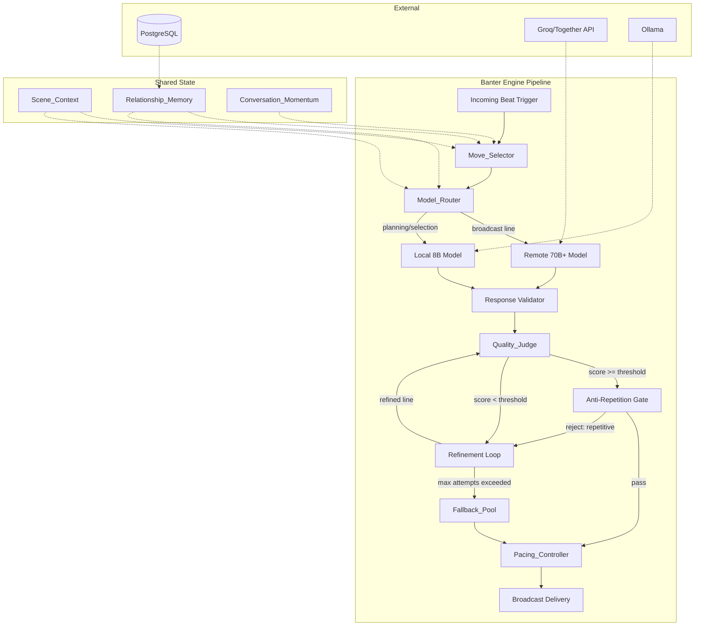

# Design Document: Broadcast-Quality Banter Engine

## Overview

The Broadcast-Quality Banter Engine replaces the current deterministic banter pipeline in `archetype_graphs.py` — specifically `_banter_quality_score` (keyword-based scoring), `_pick_reactive_move` (hardcoded archetype→move mapping), `_compose_reactive_banter` (single-template fallback), and `_banter_loop` (heuristic refinement) — with a modular, multi-layered dialogue system capable of producing sharp, character-driven banter for live Twitch broadcast.

The current system uses binary keyword presence checks (e.g., checking if "hurt" or "fear" appears in text), fixed move assignment per archetype, and a single fallback line per archetype when generation fails. The new engine introduces semantic quality evaluation, probabilistic move selection, persistent relationship memory, scene-level coordination, dual-model routing with circuit breaking, energy-aware pacing, and n-gram anti-repetition.

### Design Decisions

1. **Modular pipeline over monolithic function**: The current `_banter_loop` is a 150-line function with interleaved scoring, refinement, and fallback logic. The new design separates these into discrete components (Quality_Judge, Move_Selector, Pacing_Controller, etc.) that communicate through typed dataclasses.

2. **PostgreSQL for Relationship_Memory**: The project already uses PostgreSQL (via `db_pool.py`) and has an episodic memory table. Relationship data extends this with a dedicated `relationship_pairs` table rather than introducing a new data store.

3. **Existing circuit_breaker.py pattern extended**: The project has a per-agent circuit breaker. The Model_Router circuit breaker follows the same pattern but operates on the remote endpoint rather than per-agent.

4. **LangChain-compatible routing**: The existing `agent_runner.py` already supports Ollama, OpenAI, and Together.ai via LangChain. The Model_Router wraps this with task-based routing logic.

5. **Hypothesis for property-based testing**: The project is Python-based; Hypothesis is the standard PBT library for Python and integrates with pytest.

## Architecture



The pipeline is invoked once per beat. Each component is a Python module under `runtime/src/banter/` with a clear interface boundary. Components communicate via typed dataclasses passed through the pipeline, not shared mutable state.

## Components and Interfaces

### 1. Quality_Judge (`runtime/src/banter/quality_judge.py`)

Evaluates candidate banter lines across 5 semantic dimensions.

```python
@dataclass(frozen=True)
class QualityScore:
    sharpness: int       # 0-3: conciseness, punch, rhetorical clarity
    emotional_texture: int  # 0-3: vulnerability, tension, warmth
    rhythm: int          # 0-3: cadence, clause variety, pause points
    thematic_relevance: int  # 0-3: connection to arc_theme
    shareability: int    # 0-3: quotability, clip-worthiness

    @property
    def total(self) -> int:
        return self.sharpness + self.emotional_texture + self.rhythm + self.thematic_relevance + self.shareability

    @property
    def weak_dimensions(self) -> list[tuple[str, int]]:
        """Dimensions scoring 1 or below, for refinement feedback."""
        return [(name, val) for name, val in self.as_dict().items() if val <= 1]

    def as_dict(self) -> dict[str, int]:
        return {
            "sharpness": self.sharpness,
            "emotional_texture": self.emotional_texture,
            "rhythm": self.rhythm,
            "thematic_relevance": self.thematic_relevance,
            "shareability": self.shareability,
        }


async def evaluate(
    candidate: str,
    *,
    archetype: str,
    move: str,
    arc_theme: str,
    scene_context: SceneContextData | None = None,
    timeout_s: float = 2.0,
) -> QualityScore:
    """Evaluate a candidate line. Raises QualityJudgeError on failure or timeout."""
    ...
```

The evaluation uses a combination of:
- Sentence embedding cosine similarity (theme relevance, shareability via comparison to known "hit" lines)
- Structural heuristics (clause count for rhythm, word count for sharpness)
- Archetype vocabulary proximity (character voice match)

This replaces the current `_banter_quality()` function which uses binary keyword presence.

### 2. Move_Selector (`runtime/src/banter/move_selector.py`)

Probabilistic conversational move selection based on archetype, context, and history.

```python
MOVE_TYPES = Literal[
    "COUNTER", "ESCALATE", "DEFLECT", "TAUNT",
    "QUESTION", "PIVOT", "CONCEDE", "CALLBACK"
]

@dataclass(frozen=True)
class MoveDistribution:
    probabilities: dict[str, float]  # move_type -> probability (0.0-1.0, sums to 1.0)

    def sample(self) -> str:
        """Weighted random selection from the distribution."""
        ...

@dataclass(frozen=True)
class MoveContext:
    archetype: str
    last_3_moves: list[str]
    tension_level: int | None       # 0-10 or None if unavailable
    momentum: str | None            # "escalating" | "cooling" | "stalemate" | "shifting" | None
    arc_theme: str
    fear_keywords: list[str]
    consecutive_counters_in_pair: int
    consecutive_low_scores: int     # for "losing the room"

def compute_distribution(ctx: MoveContext) -> MoveDistribution:
    """
    Produces a probability distribution over moves.
    Invariants:
    - Sum of probabilities == 1.0 (±0.01)
    - Signature move <= 0.40
    - Every non-signature move >= 0.02
    - After 2 consecutive same moves: that move == 0.10
    - After 3+ consecutive COUNTERs in pair: only PIVOT/CONCEDE at 0.50 each
    - Tension > 7: CONCEDE+PIVOT += 0.30
    - Fear keyword match: ESCALATE+QUESTION += 0.20
    - Losing the room (2 consecutive < 6): PIVOT = 0.50
    """
    ...
```

This replaces `_pick_reactive_move()` which returns a single hardcoded move per archetype.

### 3. Fallback_Pool (`runtime/src/banter/fallback_pool.py`)

Curated, weighted template pool with context substitution and session-aware de-duplication.

```python
@dataclass
class FallbackTemplate:
    template_id: str
    archetype: str
    move_type: str
    template: str          # may contain {opponent}, {theme}, {callback}
    base_weight: float

@dataclass
class FallbackSelection:
    text: str              # fully substituted, ready for broadcast
    template_id: str
    archetype: str
    move_type: str

class FallbackPool:
    def __init__(self, templates: list[FallbackTemplate]):
        """Must have >= 12 templates per archetype, >= 2 per archetype×move."""
        ...

    def select(
        self,
        archetype: str,
        move_type: str,
        *,
        opponent_name: str | None = None,
        arc_theme: str | None = None,
        callback_phrase: str | None = None,
        recent_beat_ids: list[str] | None = None,
        session_used_ids: set[str] | None = None,
        excluded_ids: set[str] | None = None,
    ) -> FallbackSelection:
        """
        Weighted random selection with:
        - 50% weight reduction for templates used in last 10 beats
        - 80% weight reduction for templates used this session
        - Context substitution with graceful placeholder omission
        """
        ...

    def reset_session(self) -> None:
        """Reset session weights for new broadcast stream."""
        ...
```

### 4. Relationship_Memory (`runtime/src/banter/relationship_memory.py`)

Persistent pairwise interaction history with tension tracking and reconciliation arc detection.

```python
@dataclass(frozen=True)
class InteractionRecord:
    timestamp: float
    elder_a: str
    elder_b: str
    move_used: str
    emotional_valence: Literal["positive", "negative", "neutral"]
    betrayal: bool = False
    alliance: bool = False
    concession: bool = False

@dataclass
class PairState:
    tension_level: int  # clamped [0, 10]
    last_interaction_ts: float
    reconciliation_arc: bool = False
    reconciliation_remaining: int = 0  # interactions left with context injection
    peak_tension_summary: str = ""

class RelationshipMemory:
    async def record_interaction(self, record: InteractionRecord) -> None:
        """Persist interaction and update tension."""
        ...

    async def get_significant_history(
        self, elder_a: str, elder_b: str, limit: int = 5
    ) -> list[InteractionRecord]:
        """Last N significant interactions (non-neutral valence or betrayal/alliance/concession)."""
        ...

    async def get_tension(self, elder_a: str, elder_b: str) -> int:
        """Current tension level for pair, with 24h decay applied."""
        ...

    def update_tension(self, pair: PairState, move: str) -> int:
        """
        Apply move to tension:
        +1 for ESCALATE, TAUNT
        -1 for CONCEDE, DEFLECT, PIVOT
        Clamp to [0, 10]
        """
        ...
```

Backed by PostgreSQL table `relationship_pairs` extending the existing `episodes` schema. Tension decay is applied lazily on read (delta from `last_interaction_ts`).

### 5. Scene_Context (`runtime/src/banter/scene_context.py`)

Shared state for the current broadcast scene round, tracking beats, energy, and "has the room."

```python
@dataclass(frozen=True)
class Beat:
    speaker: str
    content: str
    move: str
    quality_score: int
    energy_label: Literal["hot", "warm", "flat", "dead"]
    timestamp: float

@dataclass
class SceneContextData:
    recent_beats: deque[Beat]         # max 3
    has_the_room: str | None          # elder with highest avg score (min 2 beats)
    landed_hit: Beat | None           # current landed hit (score > 12)
    landed_hit_remaining: int         # speakers who still need to acknowledge it
    scene_energy: Literal["heated", "cooling", "neutral"]

class SceneContext:
    def add_beat(self, beat: Beat) -> None:
        """Add beat, evict oldest if > 3. Update energy, has_the_room, landed hits."""
        ...

    def get_context_for_generation(self, elder: str) -> SceneContextData:
        """Return scene context for prompt injection. Never blocks."""
        ...

    def classify_energy(self) -> Literal["heated", "cooling", "neutral"]:
        """
        heated: 3+ consecutive beats scoring > 8 with ESCALATE/TAUNT
        cooling: 2+ consecutive beats scoring < 6
        neutral: otherwise
        """
        ...
```

### 6. Model_Router (`runtime/src/banter/model_router.py`)

Task-based routing between remote 70B+ model and local 8B model with circuit breaking.

```python
@dataclass(frozen=True)
class RouteDecision:
    target: Literal["remote", "local"]
    quality_threshold: int  # 8 for remote, 10 for local fallback
    timeout_s: float

@dataclass
class CircuitBreakerState:
    window_start: float
    request_count: int
    error_count: int
    tripped: bool
    tripped_at: float
    cooldown_s: float = 60.0
    window_s: float = 300.0  # 5 minutes
    error_threshold: float = 0.20
    min_requests: int = 5

class ModelRouter:
    def route(self, task_type: Literal["broadcast", "planning", "selection", "summarization"]) -> RouteDecision:
        """
        broadcast → remote (if healthy) with 4s timeout, threshold 8
        all others → local with 30s timeout
        If circuit-broken → local with threshold 10
        """
        ...

    async def call_remote(self, prompt: str, timeout_s: float = 4.0) -> str | None:
        """Call remote, record outcome, return None on failure."""
        ...

    def validate_response(self, response: str) -> bool:
        """At least 1 non-whitespace char, single line, no control sequences."""
        ...

    def should_probe(self) -> bool:
        """True if circuit-broken and 60s have elapsed."""
        ...

    async def probe_remote(self) -> bool:
        """Send single probe, restore if successful."""
        ...
```

Extends the pattern from `circuit_breaker.py` but scoped to the remote banter endpoint rather than per-agent limits.

### 7. Pacing_Controller (`runtime/src/banter/pacing_controller.py`)

Energy-aware inter-beat delay calculation with priority-based rule resolution.

```python
@dataclass(frozen=True)
class PacingDecision:
    inter_beat_delay_s: float    # [1.0, 10.0] always
    pre_delivery_pause_s: float  # 2.0 for CONCEDE, 0.0 otherwise
    rule_applied: str            # which rule won

class PacingController:
    def compute_delay(
        self,
        *,
        previous_score: int,
        upcoming_move: str,
        scene_energy: Literal["heated", "cooling", "neutral"],
        landed_hit: bool,
    ) -> PacingDecision:
        """
        Priority resolution (highest delay wins):
        1. Landed hit (score > 12): 3.0-5.0s
        2. Heated scene: 1.5-2.5s
        3. Cooling scene: 5.0-8.0s
        4. Default: 3.0-5.0s with move/score adjustments
        5. CONCEDE pre-delivery: +2.0s additive

        Final delay always clamped to [1.0, 10.0].
        """
        ...
```

### 8. Anti-Repetition Gate (`runtime/src/banter/anti_repetition.py`)

N-gram overlap detection, opener tracking, and emotional register variety enforcement.

```python
@dataclass(frozen=True)
class RepetitionVerdict:
    accepted: bool
    rejection_reason: str | None  # "3gram_overlap" | "opener_reuse" | None
    overlap_ratio: float | None   # if 3-gram check was applied

class AntiRepetitionGate:
    def __init__(self, history_window: int = 20, opener_window: int = 8):
        self._history: dict[str, deque[str]] = {}  # elder -> last N lines
        self._openers: dict[str, deque[str]] = {}  # elder -> last M openers (first 3 words)
        self._registers: dict[str, deque[str]] = {}  # elder -> last N registers

    def check(self, elder: str, candidate: str) -> RepetitionVerdict:
        """
        If history < 5: skip 3-gram, apply opener check only.
        If history >= 5: compute 3-gram overlap ratio vs each of last 20 lines.
        Reject if overlap > 0.60 or opener reused in last 8.
        """
        ...

    def compute_trigram_overlap(self, a: str, b: str) -> float:
        """Ratio of shared 3-grams to total 3-grams in the shorter string."""
        ...

    def record_delivery(self, elder: str, line: str, register: str) -> None:
        """Record a delivered line for future checks."""
        ...

    def should_shift_register(self, elder: str) -> bool:
        """True if last 3 registers are identical."""
        ...
```

### 9. Pipeline Orchestrator (`runtime/src/banter/engine.py`)

Top-level orchestration that wires all components together, replacing `_compose_reactive_banter` and `_banter_loop`.

```python
class BanterEngine:
    def __init__(
        self,
        quality_judge: QualityJudge,
        move_selector: MoveSelector,
        fallback_pool: FallbackPool,
        relationship_memory: RelationshipMemory,
        scene_context: SceneContext,
        model_router: ModelRouter,
        pacing_controller: PacingController,
        anti_repetition: AntiRepetitionGate,
        *,
        quality_threshold: int = 8,
        max_refinement_rounds: int = 2,
        max_rejection_rounds: int = 3,
    ):
        ...

    async def generate_beat(
        self,
        elder: str,
        archetype: str,
        opponent: str | None,
        arc_theme: str,
        conv_thread: list[dict],
    ) -> BeatResult:
        """
        Full pipeline:
        1. Compute move via Move_Selector
        2. Build prompt with Scene_Context + Relationship_Memory
        3. Route to model via Model_Router
        4. Score via Quality_Judge (with timeout/error handling)
        5. Refine if below threshold (up to max_refinement_rounds)
        6. Anti-repetition check (fallback after max_rejection_rounds)
        7. Compute pacing via Pacing_Controller
        8. Return BeatResult with line, delay, and metadata
        """
        ...
```

## Data Models

### Database Schema Extensions

```sql
-- Relationship Memory (extends existing episodes schema)
CREATE TABLE relationship_pairs (
    pair_id TEXT PRIMARY KEY,          -- sorted(elder_a, elder_b) hash
    elder_a TEXT NOT NULL,
    elder_b TEXT NOT NULL,
    tension_level INTEGER DEFAULT 0 CHECK (tension_level >= 0 AND tension_level <= 10),
    last_interaction_ts BIGINT DEFAULT 0,
    reconciliation_arc BOOLEAN DEFAULT FALSE,
    reconciliation_remaining INTEGER DEFAULT 0,
    peak_tension_summary TEXT DEFAULT '',
    created_at BIGINT DEFAULT (EXTRACT(EPOCH FROM NOW())::BIGINT),
    updated_at BIGINT DEFAULT (EXTRACT(EPOCH FROM NOW())::BIGINT)
);

CREATE TABLE interaction_records (
    id SERIAL PRIMARY KEY,
    pair_id TEXT REFERENCES relationship_pairs(pair_id),
    timestamp BIGINT NOT NULL,
    elder_acting TEXT NOT NULL,
    move_used TEXT NOT NULL,
    emotional_valence TEXT CHECK (emotional_valence IN ('positive', 'negative', 'neutral')),
    betrayal BOOLEAN DEFAULT FALSE,
    alliance BOOLEAN DEFAULT FALSE,
    concession BOOLEAN DEFAULT FALSE,
    summary TEXT DEFAULT ''
);

CREATE INDEX idx_interaction_pair_ts ON interaction_records(pair_id, timestamp DESC);
CREATE INDEX idx_interaction_significant ON interaction_records(pair_id, timestamp DESC)
    WHERE emotional_valence != 'neutral' OR betrayal OR alliance OR concession;
```

### In-Memory Data Structures

```python
# Fallback Pool Template Format (loaded from JSON/YAML at startup)
FALLBACK_TEMPLATES = {
    "parasite": {
        "COUNTER": [
            {"id": "p_counter_01", "template": "Useful framing, {opponent}. Still dodges the cost.", "weight": 1.0},
            {"id": "p_counter_02", "template": "If {theme} paid rent, maybe. It does not.", "weight": 1.0},
            # ... minimum 2 per move, 12+ total per archetype
        ],
        "ESCALATE": [...],
        "DEFLECT": [...],
        "TAUNT": [...],
        "QUESTION": [...],
        "PIVOT": [...],
    },
    # ... all 8 archetypes
}

# Session State (in-memory, reset on new stream)
@dataclass
class SessionState:
    session_id: str
    started_at: float
    used_template_ids: set[str]         # 80% weight reduction
    recent_beat_template_ids: deque[str]  # last 10 beats, 50% reduction
    per_elder_history: dict[str, deque[str]]  # last 20 lines per elder
    per_elder_openers: dict[str, deque[str]]  # last 8 openers per elder
    per_elder_registers: dict[str, deque[str]]  # last N registers per elder
```

### Configuration

```python
@dataclass(frozen=True)
class BanterConfig:
    quality_threshold: int = 8
    quality_threshold_local: int = 10
    max_refinement_rounds: int = 2
    max_rejection_rounds: int = 3
    remote_timeout_s: float = 4.0
    quality_judge_timeout_s: float = 2.0
    circuit_breaker_window_s: float = 300.0
    circuit_breaker_cooldown_s: float = 60.0
    circuit_breaker_error_threshold: float = 0.20
    circuit_breaker_min_requests: int = 5
    trigram_overlap_threshold: float = 0.60
    history_window: int = 20
    opener_window: int = 8
    min_fallback_per_archetype: int = 12
    min_fallback_per_move: int = 2
    session_timeout_s: float = 300.0  # 5 min gap = new session
```

## Correctness Properties

*A property is a characteristic or behavior that should hold true across all valid executions of a system — essentially, a formal statement about what the system should do. Properties serve as the bridge between human-readable specifications and machine-verifiable correctness guarantees.*

### Property 1: Quality_Judge Output Invariants

*For any* candidate string (including empty strings, single characters, and strings up to 1000 words), the Quality_Judge SHALL return exactly 5 dimension scores, each an integer in the range [0, 3], or raise a QualityJudgeError — never a partial result, never a score outside bounds.

**Validates: Requirements 1.1, 1.2**

### Property 2: Refinement Pipeline Guarantee

*For any* candidate line scoring below the configured threshold, the Banter_Engine SHALL attempt refinement exactly up to `max_refinement_rounds` times before selecting from the Fallback_Pool. The system never delivers a sub-threshold line without exhausting refinement, and never enters an infinite refinement loop.

**Validates: Requirements 1.3, 1.4**

### Property 3: Word-Count Acceptance on Error

*For any* candidate line and any Quality_Judge error condition (including timeout), the Banter_Engine SHALL accept the line if and only if its word count is in [4, 30] inclusive; lines outside that range SHALL always produce a Fallback_Pool selection instead.

**Validates: Requirements 1.5, 1.6**

### Property 4: Fallback Pool Completeness

*For any* archetype in the system, the Fallback_Pool SHALL contain at least 12 distinct templates total and at least 2 templates for each of the 6 move types (COUNTER, ESCALATE, DEFLECT, TAUNT, QUESTION, PIVOT).

**Validates: Requirements 2.1, 2.5**

### Property 5: No Raw Template Tokens in Output

*For any* fallback template and any combination of available/unavailable context fragments (opponent_name, arc_theme, callback_phrase), the substituted output SHALL never contain raw placeholder tokens (strings matching the pattern `{word}`).

**Validates: Requirements 2.3, 2.4**

### Property 6: Fallback Weight Decay

*For any* sequence of fallback selections within a session, a template used in the previous 10 beats SHALL have its effective weight reduced by 50% of base, and a template used anywhere in the current session SHALL have its effective weight reduced by 80% of base. The effective weight is the minimum of applicable reductions.

**Validates: Requirements 2.2, 2.6**

### Property 7: Tension Level Clamping

*For any* sequence of moves (ESCALATE, TAUNT, CONCEDE, DEFLECT, PIVOT, COUNTER, QUESTION, CALLBACK) and any number of 24-hour decay intervals applied to a pair, the tension level SHALL always remain an integer in the range [0, 10] inclusive.

**Validates: Requirements 3.3**

### Property 8: Tension Update Correctness

*For any* pair with tension T and a move M, the resulting tension SHALL be: T+1 if M is ESCALATE or TAUNT, T-1 if M is CONCEDE, DEFLECT, or PIVOT, and T unchanged otherwise — all subject to clamping at [0, 10]. Decay of 1 per 24-hour inactivity period SHALL never produce a negative value.

**Validates: Requirements 3.3**

### Property 9: High-Tension Move Adjustment

*For any* pair with tension > 7 and any base probability distribution, the Move_Selector SHALL produce a distribution where CONCEDE + PIVOT probability is at least 30 percentage points higher than in the base distribution (before other modifiers), while the total distribution still sums to 1.0 (±0.01).

**Validates: Requirements 3.4**

### Property 10: Move Distribution Invariants

*For any* archetype, any combination of inputs (momentum, tension, last moves, arc theme, fear keywords), the Move_Selector output distribution SHALL: (a) sum to 1.0 ±0.01, (b) assign the signature move no more than 0.40, and (c) assign every non-signature move at least 0.02 — unless overridden by the COUNTER-loop restriction (Property 12).

**Validates: Requirements 4.2**

### Property 11: Consecutive Move Penalty

*For any* elder whose last 2 moves are identical, the Move_Selector SHALL produce a distribution where that move's probability is exactly 0.10, with the removed weight redistributed proportionally across remaining moves, and the total still sums to 1.0 ±0.01.

**Validates: Requirements 4.3**

### Property 12: Counter-Loop Breaker

*For any* pair where 3 or more consecutive COUNTER moves have occurred (regardless of direction), the Move_Selector SHALL restrict the responding elder's distribution to exactly {PIVOT: 0.50, CONCEDE: 0.50} with all other moves at 0.0.

**Validates: Requirements 4.4**

### Property 13: Scene Context Window Bound

*For any* sequence of beats added to the Scene_Context, the context SHALL contain at most 3 beats at any time. Adding a 4th beat SHALL evict the oldest before storing the new one.

**Validates: Requirements 5.1**

### Property 14: Landed Hit Acknowledgment Counter

*For any* beat scoring above 12, the Scene_Context SHALL include a "landed hit" instruction for exactly the next 2 speakers and then remove it. The counter decrements by 1 per subsequent speaker and never goes negative.

**Validates: Requirements 5.3**

### Property 15: Has-The-Room Assignment

*For any* set of beats in the current scene, "has the room" SHALL be assigned to the elder with the highest average quality score across at least 2 beats. In case of a tie, the elder who most recently delivered a beat scoring above 8 SHALL be designated.

**Validates: Requirements 5.5**

### Property 16: Circuit Breaker Activation Conditions

*For any* rolling 5-minute window of request outcomes, the circuit breaker SHALL activate if and only if: (a) at least 5 requests have been made in the window, AND (b) the error rate exceeds 20%. It SHALL NOT activate with fewer than 5 requests regardless of error rate.

**Validates: Requirements 6.6**

### Property 17: Response Validation

*For any* string returned by the remote model, the validator SHALL accept it if and only if it contains at least 1 non-whitespace character, contains no control sequences (bytes < 0x20 except space/newline), and does not contain multi-turn formatting markers. All other strings SHALL be rejected.

**Validates: Requirements 6.4**

### Property 18: Pacing Delay Bounds

*For any* combination of previous beat score, upcoming move, scene energy classification, and landed-hit status, the final inter-beat delay SHALL always be in the range [1.0, 10.0] seconds inclusive. No input combination can produce a delay outside these bounds.

**Validates: Requirements 7.6**

### Property 19: Pacing Rule Resolution

*For any* scenario where multiple pacing rules (landed-hit pause, heated reduction, cooling increase) apply simultaneously, the rule producing the longest delay SHALL win. The CONCEDE pre-delivery pause of exactly 2.0 seconds is always additive to the inter-beat delay (not subject to conflict resolution).

**Validates: Requirements 7.2, 7.7**

### Property 20: Trigram Overlap Rejection

*For any* candidate line and any 20-line history where the history contains at least 5 entries, if the candidate has greater than 60% 3-gram overlap ratio to any line in the history, the candidate SHALL be rejected. If the history contains fewer than 5 entries, the 3-gram check SHALL be skipped.

**Validates: Requirements 8.1, 8.2, 8.6**

### Property 21: Opener Uniqueness

*For any* candidate line whose first 3 words (lowercased, stripped) match any opener in the elder's last 8 delivered lines, the candidate SHALL be rejected regardless of history size.

**Validates: Requirements 8.3**

### Property 22: Anti-Repetition Fallback Guarantee

*For any* elder, if 3 consecutive candidates are rejected by anti-repetition checks, the system SHALL select from the Fallback_Pool (excluding the last 5 used templates) on the next cycle. The system never rejects more than 3 consecutive candidates without falling back.

**Validates: Requirements 8.5**

### Property 23: Reconciliation Arc Detection

*For any* pair whose tension drops below 3 after having previously exceeded 7, the system SHALL flag the pair as having a "reconciliation arc" and include peak-tension context in the next 5 interactions for that pair.

**Validates: Requirements 3.5**

## Error Handling

### Quality_Judge Failures
- **Timeout (>2s)**: Treat as evaluation error → apply word-count acceptance rule (4-30 words = accept, else fallback)
- **Exception during scoring**: Same path as timeout
- **Malformed score output**: Log warning, treat as error

### Relationship_Memory Unavailable
- **DB connection failure**: Fall back to current conversation thread (6-turn window from existing `conv_thread`)
- **Slow query (>500ms budget)**: Cancel query, proceed without relationship context
- **Corrupted pair state**: Reset pair to defaults (tension=0, no reconciliation)

### Model_Router Failures
- **Remote timeout (>4s)**: Record error, fall back to local 8B with threshold 10
- **Remote 5xx/connection error**: Record error, fall back to local
- **Remote returns empty/invalid**: Discard, retry on local with threshold 10
- **Circuit breaker tripped**: All broadcast requests go local for 60s, then single probe
- **Local model also fails**: Use Fallback_Pool directly (skip quality scoring)

### Scene_Context Failures
- **State corruption**: Reset to empty scene, proceed with degraded context (last single beat from prompt history)
- **Memory pressure**: Evict oldest beats aggressively (maintain max 3 invariant)

### Anti-Repetition Edge Cases
- **Elder has no history (<5 lines)**: Skip 3-gram check, apply opener check only
- **All fallback templates exhausted by exclusion**: Reset exclusion set, select with session weights only
- **3 consecutive rejections**: Guaranteed fallback on next cycle (no infinite loops)

### Pacing Controller
- **Invalid score input (None, negative)**: Default to neutral 3.0s delay
- **Multiple conflicting rules**: Longest delay wins, always clamped to [1.0, 10.0]

### Session Boundaries
- **Gap > 5 minutes between beats**: Auto-detect new session, reset all session-scoped state (fallback weights, anti-repetition history, scene context)

## Testing Strategy

### Property-Based Testing

**Library**: [Hypothesis](https://hypothesis.readthedocs.io/) (Python PBT framework)
**Minimum iterations**: 100 per property test
**Tag format**: `# Feature: broadcast-quality-banter-engine, Property {N}: {title}`

Property tests cover the 23 correctness properties defined above. Each property maps to a single Hypothesis test that generates random inputs and verifies the invariant holds universally.

Key generators needed:
- `st_candidate_line()`: Random strings 0-100 words, including edge cases (empty, whitespace-only, very long)
- `st_archetype()`: One of the 8 archetype strings
- `st_move()`: One of the 8 move types
- `st_move_sequence(min_size, max_size)`: Random sequences of moves
- `st_tension_level()`: Integer [0, 10]
- `st_quality_score()`: QualityScore with each dimension in [0, 3]
- `st_beat_sequence(min_size, max_size)`: Random Beat objects with scores and moves
- `st_request_outcomes(min_size, max_size)`: Sequences of (timestamp, success/failure)
- `st_pacing_inputs()`: Random combinations of score, move, energy, landed_hit
- `st_fallback_template()`: Template strings with random placeholder combinations
- `st_context_fragments()`: Optional opponent_name, arc_theme, callback_phrase

### Unit Tests (Example-Based)

Unit tests focus on specific scenarios and integration points:

- **Quality_Judge**: Known-good and known-bad lines with expected dimension scores
- **Move_Selector**: Specific archetype scenarios verifying the correct move bias
- **Fallback_Pool**: Session reset behavior, template loading validation
- **Model_Router**: Probe-after-circuit-break sequence, response validation edge cases
- **Pacing_Controller**: Specific rule priority scenarios (landed hit overrides heated scene)
- **Scene_Context**: "Has the room" tie-breaking with concrete beat sequences
- **Anti-Repetition**: Exact 3-gram overlap calculation for known string pairs
- **Relationship_Memory**: Reconciliation arc trigger with specific tension trajectories

### Integration Tests

- **End-to-end pipeline**: Feed a real conversation thread through BanterEngine.generate_beat(), verify output is a valid delivered line with correct pacing
- **Database round-trip**: Write interaction records, verify retrieval with significance filter
- **Model routing**: Mock Groq/Together endpoints, verify fallback and circuit-breaking behavior under load
- **Session boundary detection**: Verify state reset after 5-minute gap

### Test Organization

```
tests/
  banter/
    test_quality_judge.py          # Unit + Property tests for scoring
    test_move_selector.py          # Unit + Property tests for distributions
    test_fallback_pool.py          # Unit + Property tests for selection/substitution
    test_relationship_memory.py    # Unit + Property tests for tension/history
    test_scene_context.py          # Unit + Property tests for beat window
    test_model_router.py           # Unit + Property tests for routing/circuit-breaker
    test_pacing_controller.py      # Unit + Property tests for delay calculation
    test_anti_repetition.py        # Unit + Property tests for n-gram/opener checks
    test_engine_integration.py     # Integration tests for full pipeline
    conftest.py                    # Shared fixtures, generators, mocks
```
