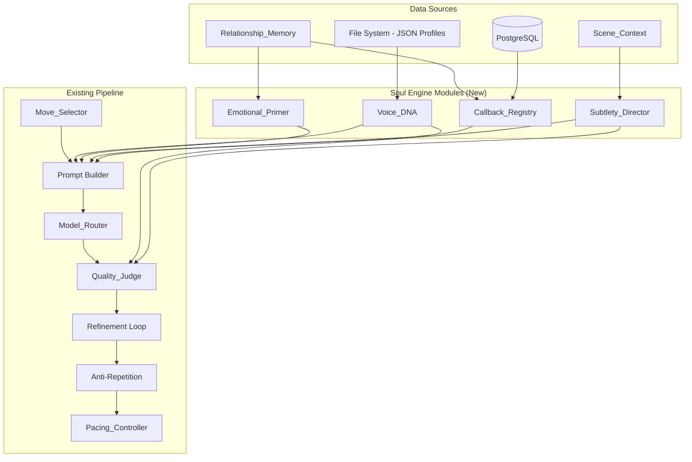

# Design Document: Elder Voice Soul Engine

## Overview

The Elder Voice Soul Engine adds four new modules to the existing `runtime/src/banter/` pipeline that inject "soul" — deep linguistic identity, visceral emotional priming, deliberate callbacks, and layered subtext — into the Broadcast-Quality Banter Engine. These modules compose their output into the generation prompt in a defined order, each operating independently with fault isolation, so that any module failure degrades gracefully without blocking broadcast generation.

The existing pipeline (BanterEngine → MoveSelector → prompt building → ModelRouter → QualityJudge → refinement → AntiRepetition → pacing) remains unchanged. The soul engine modules inject additional context into the prompt-building phase and extend the QualityJudge with two new scoring dimensions.

### Design Goals

1. **Recognizability**: Each Elder's speech is immediately identifiable from sentence structure alone.
2. **Emotional authenticity**: Lines feel the history between Elders rather than reciting facts.
3. **Shared memory**: Callbacks reward long-term viewers with continuity and payoff.
4. **Layered meaning**: Subtext creates "wait, did they just—" moments for attentive viewers.
5. **Zero regression**: The existing pipeline operates identically when soul modules are disabled.
6. **Fault isolation**: Any individual module failure never blocks or delays broadcast generation.

## Architecture

The soul engine integrates as a middleware layer within the existing `_build_prompt` method of `BanterEngine`. Each module is injected via dependency injection, matching the existing pattern used for QualityJudge, ModelRouter, and RelationshipMemory.



### Prompt Composition Order

When building the generation prompt, sections are composed in this order:

1. **Voice_DNA profile injection** — archetype linguistic instructions
2. **Emotional_Primer context** — visceral present-tense emotional framing
3. **Callback_Registry content** — callback reference with framing instruction (if available)
4. **Subtlety_Director instructions** — subtext technique and layers (if applicable)
5. **Existing prompt components** — Scene_Context, relationship history, generation instruction, conversation thread

The combined token count from modules 1–4 is hard-capped at 800 tokens. Each module has an individual budget: Voice_DNA ≤ 250 tokens, Emotional_Primer ≤ 200 tokens, Callback_Registry ≤ 200 tokens, Subtlety_Director ≤ 150 tokens.

### Configuration

A new `SoulEngineConfig` dataclass controls feature flags:

```python
@dataclass(frozen=True)
class SoulEngineConfig:
    enabled: bool = True
    voice_dna_enabled: bool = True
    emotional_primer_enabled: bool = True
    callback_registry_enabled: bool = True
    subtlety_director_enabled: bool = True
    max_total_tokens: int = 800
    voice_dna_token_budget: int = 250
    emotional_primer_token_budget: int = 200
    callback_token_budget: int = 200
    subtlety_token_budget: int = 150
```

When `enabled = False`, all soul modules are skipped and the pipeline behaves identically to the pre-soul-engine version.

## Components and Interfaces

### Voice_DNA Module

**File**: `runtime/src/banter/voice_dna.py`

**Responsibilities**:
- Load and validate VoiceDNA profiles from JSON files at startup
- Hot-reload profiles on file system changes (30-second polling)
- Inject archetype-specific linguistic instructions into prompts
- Provide voice conformance scoring for the Quality_Judge

```python
class VoiceDNA:
    """Manages VoiceDNA profiles and provides prompt injection + scoring."""

    def __init__(self, profiles_dir: Path, config: SoulEngineConfig):
        ...

    async def load_profiles(self) -> None:
        """Load and validate all 8 archetype profiles from disk."""
        ...

    def get_prompt_injection(self, archetype: str) -> str | None:
        """Return structured linguistic instructions for prompt injection.
        Returns None if profile unavailable (triggers fallback)."""
        ...

    def score_voice_conformance(self, candidate: str, archetype: str) -> int:
        """Score how well a line matches the archetype's VoiceDNA (0-3)."""
        ...

    async def check_for_reload(self) -> None:
        """Poll for file changes and reload modified profiles."""
        ...
```

**Profile Schema** (per `{archetype}.json`):

```json
{
  "archetype": "parasite",
  "sentence_structures": ["...", "...", "..."],
  "verbal_tics": ["...", "..."],
  "rhythm_patterns": [{
    "name": "clipped_dismissive",
    "clause_count_range": [1, 2],
    "word_count_per_clause_range": [3, 8],
    "pause_placement": "before_final"
  }],
  "micro_phrases": ["...", "...", "...", "..."],
  "rhetorical_devices": ["...", "..."],
  "opening_patterns": ["...", "..."],
  "closing_patterns": ["...", "..."]
}
```

### Emotional_Primer Module

**File**: `runtime/src/banter/emotional_primer.py`

**Responsibilities**:
- Transform InteractionRecord history into visceral present-tense emotional context
- Frame emotions through the lens of the speaking Elder's archetype
- Intensify language at high tension, use mixed-feeling language during reconciliation
- Produce output within strict sentence bounds (≤3 per event, ≤15 total)

```python
class EmotionalPrimer:
    """Transforms relationship history into visceral emotional context."""

    def __init__(self, config: SoulEngineConfig):
        ...

    async def generate_emotional_context(
        self,
        archetype: str,
        history: list[InteractionRecord],
        tension_level: int,
        reconciliation_active: bool,
    ) -> str | None:
        """Transform history into present-tense emotional framing.
        Returns None on error (triggers fallback to raw history)."""
        ...
```

**Transformation rules**:
- Input: `InteractionRecord` list (from RelationshipMemory)
- Output: Present-tense emotional statements (never past-tense event descriptions)
- Each archetype has an emotion mapping that reframes the same events differently
- High tension (>5): visceral markers ("burns", "cuts", "won't forget")
- Low tension (≤5): observational markers ("still remembers", "notes the pattern")
- Reconciliation: mixed-feeling markers ("wants to believe... but watches for the knife")
- No history: neutral curiosity ("sizing them up", "hasn't decided yet")

### Callback_Registry Module

**File**: `runtime/src/banter/callback_registry.py`

**Responsibilities**:
- Store memorable moments (score > 12) with full metadata
- Detect and flag running gags and sore spots
- Surface callbacks at dramaturgically optimal moments
- Enforce usage limits (15-beat gap, 2 per pair per session, 50 moments cap, 10 gags cap)
- Persist to PostgreSQL; buffer writes when DB unavailable

```python
class CallbackRegistry:
    """Persistent store of memorable moments with dramaturgical surfacing."""

    def __init__(self, pool, config: SoulEngineConfig):
        ...

    async def store_memorable_moment(
        self,
        speaker: str,
        target: str,
        line: str,
        move: str,
        arc_theme: str,
        valence: str,
        summary: str,
        score: int,
    ) -> None:
        """Store a high-scoring line as a memorable moment. Enforces 50-entry cap."""
        ...

    async def surface_callback(
        self,
        speaker: str,
        target: str,
        current_tension: int,
        current_arc_theme: str,
        current_beat_number: int,
        session_callback_count: int,
    ) -> CallbackSurface | None:
        """Surface the best-matching callback for current conditions.
        Returns None if no suitable callback exists or limits exceeded."""
        ...

    def compute_pair_id(self, elder_a: str, elder_b: str) -> str:
        """Compute pair_id identically to RelationshipMemory._compute_pair_id."""
        ...

    async def get_sore_spots(self, target: str, arc_theme: str) -> list[SoreSpot]:
        """Get sore spots for a target Elder matching the current theme."""
        ...
```

**Database Tables** (same schema/pool as RelationshipMemory):

```sql
CREATE TABLE callback_moments (
    id SERIAL PRIMARY KEY,
    pair_id VARCHAR(16) NOT NULL,
    speaker VARCHAR(64) NOT NULL,
    target VARCHAR(64) NOT NULL,
    line TEXT NOT NULL,
    move VARCHAR(32) NOT NULL,
    arc_theme VARCHAR(128) NOT NULL,
    valence VARCHAR(16) NOT NULL,
    summary VARCHAR(256) NOT NULL,
    score INTEGER NOT NULL,
    beat_number INTEGER NOT NULL,
    created_at BIGINT NOT NULL
);

CREATE TABLE callback_running_gags (
    id SERIAL PRIMARY KEY,
    pair_id VARCHAR(16) NOT NULL,
    pattern_description TEXT NOT NULL,
    topic VARCHAR(128) NOT NULL,
    interaction_count INTEGER NOT NULL DEFAULT 0,
    created_at BIGINT NOT NULL
);

CREATE TABLE callback_sore_spots (
    id SERIAL PRIMARY KEY,
    elder_name VARCHAR(64) NOT NULL,
    topic VARCHAR(128) NOT NULL,
    trigger_phrase TEXT,
    tension_delta INTEGER NOT NULL,
    created_at BIGINT NOT NULL
);
```

### Subtlety_Director Module

**File**: `runtime/src/banter/subtlety_director.py`

**Responsibilities**:
- Determine when a line should carry subtext based on dramatic conditions
- Inject subtext instructions (surface meaning, implied meaning, technique)
- Enforce technique variety (same technique ≤ 2 in 5 consecutive uses per Elder)
- Reduce activation rate to 20% at extreme tension (>8)
- Provide subtext_depth scoring for Quality_Judge

```python
class SubtletyDirector:
    """Manages subtext injection and scoring for layered meaning."""

    TECHNIQUES = [
        "loaded_question",
        "double_entendre",
        "callback_inversion",
        "strategic_omission",
        "damning_praise",
    ]

    def __init__(self, config: SoulEngineConfig):
        ...

    def should_inject_subtext(
        self,
        tension: int,
        move: str,
        has_sore_spot: bool,
        has_history: bool,
    ) -> bool:
        """Determine if subtext should be injected for this generation.
        Applies 20% rate at tension > 8."""
        ...

    def generate_subtext_instruction(
        self,
        elder: str,
        target: str,
        tension: int,
        sore_spot: SoreSpot | None,
        arc_theme: str,
    ) -> SubtextInstruction | None:
        """Build subtext instruction with surface/implied meaning and technique.
        Enforces technique variety constraint."""
        ...

    def score_subtext_depth(self, candidate: str, instruction: SubtextInstruction) -> int:
        """Score subtext depth (0-3) for Quality_Judge integration."""
        ...
```

**Activation Conditions** (at least one must be true):
- Pair tension between 4 and 8
- Current move is DEFLECT or QUESTION
- Target Elder has a stored sore spot matching current arc theme

**Deactivation Override**:
- Tension > 8: probability reduced to 20% (direct confrontation dominates)
- Tension < 2: no activation
- Move is CONCEDE: no activation
- No relationship history: no activation

### Enhanced Quality_Judge

**File**: Modified `runtime/src/banter/quality_judge.py`

The existing Quality_Judge gains two new dimensions when soul engine is active:

- **voice_authenticity** (0–3): Conformance to VoiceDNA profile patterns
- **subtext_depth** (0–3): Layers of meaning when subtext was injected

```python
@dataclass(frozen=True)
class EnhancedQualityScore:
    """Extended quality score with soul engine dimensions."""

    # Existing 5 dimensions
    sharpness: int
    emotional_texture: int
    rhythm: int
    thematic_relevance: int
    shareability: int

    # Soul engine dimensions
    voice_authenticity: int = 0  # 0-3, from VoiceDNA conformance
    subtext_depth: int = 0       # 0-3, only when subtext was injected

    @property
    def total(self) -> int:
        """Total score: 0-18 with soul engine, 0-15 without."""
        return (
            self.sharpness + self.emotional_texture + self.rhythm
            + self.thematic_relevance + self.shareability
            + self.voice_authenticity
        )
```

**Scoring rules**:
- `voice_authenticity` = `VoiceDNA.score_voice_conformance()` output
- `subtext_depth` is scored only when `SubtletyDirector` injected subtext; otherwise 0
- `subtext_depth` is added to `shareability` for bonus, capped at 3
- Total possible: 15 (base) + 3 (voice_authenticity) = 18
- Quality thresholds raised: remote 8→10, local 10→12

### Enhanced BanterEngine Integration

**File**: Modified `runtime/src/banter/engine.py`

The `BanterEngine.__init__` gains four optional parameters:

```python
def __init__(
    self,
    # ... existing parameters ...
    voice_dna: VoiceDNA | None = None,
    emotional_primer: EmotionalPrimer | None = None,
    callback_registry: CallbackRegistry | None = None,
    subtlety_director: SubtletyDirector | None = None,
    soul_config: SoulEngineConfig | None = None,
) -> None:
```

The `_build_prompt` method is extended to compose soul module injections before existing prompt components. Each module call is wrapped in a try/except that logs failures at DEBUG level and continues with remaining modules.

## Data Models

### New Types (`runtime/src/banter/soul_types.py`)

```python
@dataclass(frozen=True)
class VoiceDNAProfile:
    """Complete linguistic fingerprint for an archetype."""
    archetype: str
    sentence_structures: list[str]       # min 3
    verbal_tics: list[str]               # min 2
    rhythm_patterns: list[RhythmPattern] # min 1
    micro_phrases: list[str]             # min 4
    rhetorical_devices: list[str]        # min 2
    opening_patterns: list[str]          # min 2
    closing_patterns: list[str]          # min 2


@dataclass(frozen=True)
class RhythmPattern:
    """Quantified rhythm constraint."""
    name: str
    clause_count_range: tuple[int, int]
    word_count_per_clause_range: tuple[int, int]
    pause_placement: str  # "before_final" | "between_clauses" | "front_loaded"


@dataclass(frozen=True)
class CallbackSurface:
    """A surfaced callback ready for prompt injection."""
    original_line: str
    original_context: str
    suggested_framing: str  # "direct_quote" | "paraphrase" | "inversion" | "escalation"
    summary: str
    beat_number_used: int


@dataclass(frozen=True)
class SoreSpot:
    """A known vulnerability for targeted provocation."""
    elder_name: str
    topic: str
    trigger_phrase: str | None
    tension_delta: int


@dataclass(frozen=True)
class SubtextInstruction:
    """Instruction for layered meaning generation."""
    surface_meaning: str
    implied_meaning: str
    technique: str  # one of SubtletyDirector.TECHNIQUES
    context_hint: str


@dataclass(frozen=True)
class MemorableMoment:
    """A stored high-scoring line for future callback."""
    speaker: str
    target: str
    line: str
    move: str
    arc_theme: str
    valence: str
    summary: str
    score: int
    beat_number: int
    created_at: float


@dataclass
class CallbackUsageTracker:
    """Tracks callback usage for rate limiting within a session."""
    last_used_beat: dict[str, int] = field(default_factory=dict)  # callback_id → beat
    pair_session_count: dict[str, int] = field(default_factory=dict)  # pair_id → count


@dataclass
class WriteBuffer:
    """In-memory buffer for DB writes when database is unavailable."""
    entries: deque[MemorableMoment] = field(default_factory=lambda: deque(maxlen=20))

    def add(self, moment: MemorableMoment) -> None:
        """Add to buffer. If full (20), oldest entry is dropped."""
        self.entries.append(moment)  # deque(maxlen=20) handles eviction
```

### Schema Validation

```python
VOICE_DNA_SCHEMA = {
    "sentence_structures": {"min_count": 3},
    "verbal_tics": {"min_count": 2},
    "rhythm_patterns": {"min_count": 1},
    "micro_phrases": {"min_count": 4},
    "rhetorical_devices": {"min_count": 2},
    "opening_patterns": {"min_count": 2},
    "closing_patterns": {"min_count": 2},
}

def validate_voice_dna_profile(data: dict) -> tuple[bool, list[str]]:
    """Validate a VoiceDNA profile dict against schema.
    Returns (is_valid, list_of_violations)."""
    ...
```

## Correctness Properties

*A property is a characteristic or behavior that should hold true across all valid executions of a system — essentially, a formal statement about what the system should do. Properties serve as the bridge between human-readable specifications and machine-verifiable correctness guarantees.*

### Property 1: VoiceDNA Schema Validation

*For any* VoiceDNA profile data dictionary, the schema validator accepts it if and only if it contains all 7 required fields with at least the specified minimum counts (3 sentence structures, 2 verbal tics, 1 rhythm pattern, 4 micro-phrases, 2 rhetorical devices, 2 opening patterns, 2 closing patterns).

**Validates: Requirements 1.1, 8.4**

### Property 2: Voice Conformance Score Bounds

*For any* candidate line string and any archetype name, the voice conformance score is always an integer in [0, 3].

**Validates: Requirements 1.3**

### Property 3: Archetype Linguistic Differentiation

*For any* two distinct archetypes A and B from the set of 8, their VoiceDNA profiles differ in at least 4 of the 7 structural categories (sentence structures, verbal tics, rhythm patterns, micro-phrases, rhetorical devices, opening patterns, closing patterns).

**Validates: Requirements 2.1, 2.2, 2.3, 2.4, 2.5, 2.6, 2.7, 2.8**

### Property 4: Emotional_Primer Present-Tense Invariant

*For any* list of InteractionRecords and any archetype, the Emotional_Primer output contains only present-tense emotional framing and never contains past-tense event descriptions with timestamps.

**Validates: Requirements 3.1**

### Property 5: Emotional_Primer Output Size Bounds

*For any* list of InteractionRecords (regardless of length), the Emotional_Primer output never exceeds 3 sentences per relationship event and never exceeds 15 sentences total.

**Validates: Requirements 3.5**

### Property 6: Emotional_Primer Archetype-Specific Output

*For any* non-empty list of InteractionRecords, two different archetypes always produce different Emotional_Primer output text given the same history input.

**Validates: Requirements 3.2**

### Property 7: Callback Registry Capacity Invariant

*For any* sequence of write operations to the Callback_Registry, the stored count never exceeds 50 memorable moments per Elder pair and never exceeds 10 running gags per Elder pair; the (N+1)th entry evicts the oldest.

**Validates: Requirements 4.5, 9.5**

### Property 8: Callback Timing Constraints

*For any* sequence of callback surfacing requests, the same callback is never surfaced within 15 beats of its previous use, and no more than 2 callbacks are surfaced per Elder pair per broadcast session.

**Validates: Requirements 5.3**

### Property 9: Callback Surfacing Match Quality

*For any* set of available callbacks and current dramatic conditions, the surfacing algorithm returns the callback whose original context most closely matches the current conditions (tension within 2, theme overlap, emotional register match), or returns None if no callback meets the matching threshold.

**Validates: Requirements 5.1, 5.6**

### Property 10: Subtlety Director Activation Logic

*For any* state tuple (tension, move, has_sore_spot, has_history), the Subtlety_Director activates subtext injection if and only if at least one activation condition is met (tension 4–8, move is DEFLECT/QUESTION, or matching sore spot exists) AND no override condition applies (tension < 2, no history, move is CONCEDE).

**Validates: Requirements 6.2, 6.6**

### Property 11: Subtlety High-Tension Rate Reduction

*For any* sequence of 10 or more consecutive subtext opportunities where pair tension exceeds 8, the Subtlety_Director activates subtext injection no more than 20% of the time.

**Validates: Requirements 6.3**

### Property 12: Technique Variety Constraint

*For any* Elder and any sliding window of 5 consecutive subtext-injected lines, the same subtext technique appears no more than twice.

**Validates: Requirements 6.5**

### Property 13: Soul Engine Token Budget

*For any* combination of soul module outputs (Voice_DNA + Emotional_Primer + Callback_Registry + Subtlety_Director), the combined token count never exceeds 800 tokens.

**Validates: Requirements 7.2**

### Property 14: Module Fault Isolation

*For any* combination of soul engine module failures (Voice_DNA, Emotional_Primer, Callback_Registry, or Subtlety_Director raising exceptions or timing out), the BanterEngine still produces a valid BeatResult using the remaining functional modules and existing pipeline without blocking.

**Validates: Requirements 1.6, 3.7, 4.6, 7.3**

### Property 15: VoiceDNA Serialization Round-Trip

*For any* valid VoiceDNA profile object, serializing to JSON and parsing back produces an equivalent VoiceDNA profile: `parse(serialize(profile)) == profile`.

**Validates: Requirements 8.6**

### Property 16: Pair ID Computation Equivalence

*For any* pair of Elder names (elder_a, elder_b), the pair_id computed by Callback_Registry is identical to the pair_id computed by RelationshipMemory's `_compute_pair_id` function.

**Validates: Requirements 9.4**

### Property 17: Write Buffer Capacity

*For any* sequence of writes to the in-memory buffer (during DB unavailability), the buffer never exceeds 20 entries; the 21st entry causes the oldest to be dropped.

**Validates: Requirements 9.6**

### Property 18: Quality_Judge Dimension Count

*For any* candidate line evaluation, the Quality_Judge returns exactly 7 dimension scores (each integer in [0, 3]) when soul engine is active, and exactly 5 dimension scores when soul engine is disabled.

**Validates: Requirements 10.1, 10.2**

### Property 19: Subtext Depth Conditional Scoring

*For any* Quality_Judge evaluation, the subtext_depth score is non-zero if and only if a SubtextInstruction was injected for that generation. When no subtext was injected, subtext_depth is exactly 0.

**Validates: Requirements 10.3, 10.5**

### Property 20: Quality Threshold Configuration

*For any* BanterEngine configuration state, the quality thresholds are (10 remote, 12 local) if and only if soul engine modules are active, and (8 remote, 10 local) when soul engine is disabled.

**Validates: Requirements 10.4**

### Property 21: Prompt Composition Order

*For any* generated prompt containing soul engine injections, the Voice_DNA section precedes Emotional_Primer, which precedes Callback_Registry content, which precedes Subtlety_Director instructions, which precedes existing pipeline components.

**Validates: Requirements 7.1**

### Property 22: Shareability Bonus Conditional

*For any* delivered line and surfaced callback, the shareability bonus (+1) is applied if and only if the line contains keyword overlap with the callback summary.

**Validates: Requirements 5.5**

### Property 23: Failed Validation Profile Retention

*For any* VoiceDNA profile that fails schema validation during hot-reload, the previously loaded valid profile for that archetype remains active and is used for all subsequent prompt injections.

**Validates: Requirements 8.5**

## Error Handling

### Fault Isolation Strategy

Each soul engine module is wrapped in an independent try/except within the prompt-building phase. Failures are handled as follows:

| Module | Failure Mode | Fallback Behavior |
|--------|-------------|-------------------|
| Voice_DNA | Profile unavailable or load error | Use existing vocabulary proximity scoring in Quality_Judge |
| Voice_DNA | Hot-reload validation failure | Retain previous valid profile; log warning |
| Emotional_Primer | Transformation error or timeout | Inject raw relationship history (existing behavior) |
| Emotional_Primer | No history available | Inject neutral curiosity framing |
| Callback_Registry | DB unavailable for read | Generate without callback context |
| Callback_Registry | DB unavailable for write | Buffer up to 20 writes; flush on reconnect |
| Subtlety_Director | Instruction generation error | Generate with direct intention only (no subtext) |
| Quality_Judge (enhanced) | Soul dimension scoring error | Score only existing 5 dimensions; use standard thresholds |

### Error Propagation Rules

1. No soul engine error propagates to the caller of `generate_beat()`.
2. All errors are logged at DEBUG level with full context (module, input summary, traceback).
3. Module-level circuit breakers are NOT used — each call is independent because the cost of retrying is low and the prompt-building phase has a 200ms total budget.
4. The `BeatResult.metadata` dict records which modules succeeded/failed for post-broadcast analysis.

### Timeout Budget

The 200ms total budget for soul engine prompt-building is enforced by an `asyncio.wait_for` wrapper:
- Voice_DNA profile lookup: <1ms (in-memory dict)
- Emotional_Primer transformation: ≤50ms (string formatting with archetype template)
- Callback_Registry surfacing: ≤100ms (single DB query + in-memory filtering)
- Subtlety_Director instruction: <1ms (condition evaluation + template selection)

If any module exceeds its individual budget, `asyncio.TimeoutError` is caught and treated as a module failure.

## Testing Strategy

### Property-Based Testing (Hypothesis)

The project already includes `hypothesis>=6.100.0` in `runtime/requirements.txt`. Each correctness property maps to a dedicated Hypothesis property test with a minimum of 100 iterations.

**Test file**: `runtime/tests/test_soul_engine_properties.py`

**Configuration**:
```python
from hypothesis import given, settings, HealthCheck
from hypothesis import strategies as st

@settings(max_examples=100, suppress_health_check=[HealthCheck.too_slow])
```

**Tag format**: Each property test is tagged with a comment:
```python
# Feature: elder-voice-soul-engine, Property 1: VoiceDNA schema validation
```

**Key generators**:
- `st_archetype()`: Random archetype from the set of 8
- `st_voice_dna_profile()`: Random valid/invalid VoiceDNA profile dicts
- `st_interaction_records()`: Random lists of InteractionRecord objects
- `st_tension_level()`: Integer in [0, 10]
- `st_candidate_line()`: Random broadcast-quality line strings
- `st_callback_sequence()`: Random sequences of callback write/read operations

### Unit Tests (pytest)

Example-based tests for specific scenarios and edge cases:

- Specific archetype profile content validation (one test per archetype)
- Reconciliation arc mixed-feeling language detection
- Callback surfacing with exact dramatic condition matches
- Subtext deactivation when move is CONCEDE
- Integration test: full `generate_beat()` with all soul modules active
- Integration test: `generate_beat()` with individual modules failing

### Integration Tests

- Database persistence round-trip for Callback_Registry
- Hot-reload behavior (file modification → profile update within 30s)
- End-to-end latency measurement (soul modules add ≤200ms)
- Startup validation (all 8 profiles loaded and valid)

### Test Organization

```
runtime/tests/
├── test_soul_engine_properties.py   # All 23 property tests
├── test_voice_dna.py                # Voice_DNA unit tests
├── test_emotional_primer.py         # Emotional_Primer unit tests
├── test_callback_registry.py        # Callback_Registry unit + integration tests
├── test_subtlety_director.py        # Subtlety_Director unit tests
├── test_quality_judge_enhanced.py   # Enhanced Quality_Judge tests
└── test_soul_engine_integration.py  # Full pipeline integration tests
```
