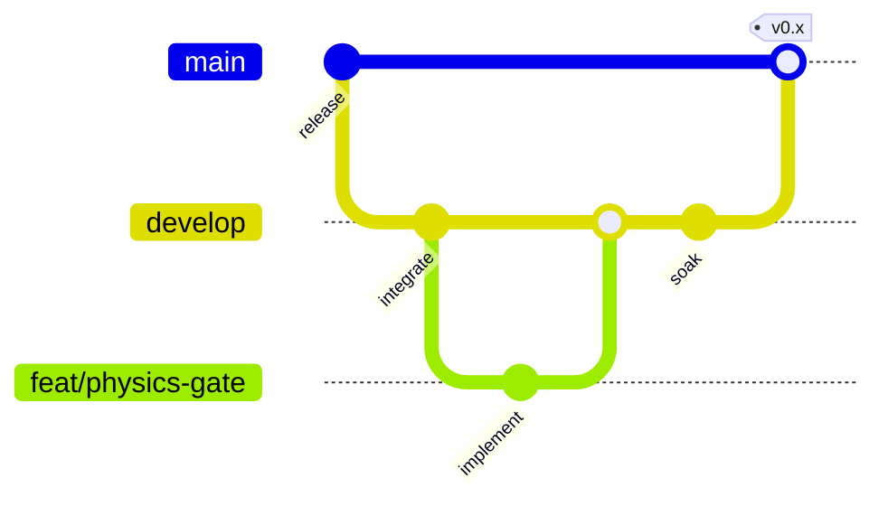

# Git Workflow

> Airtight branch discipline for open-source contributors. **main** is sacred; **develop** integrates; **feature branches** do the work.

---

## Branch topology



| Branch | Lifetime | Created from | Merges into |
|--------|----------|--------------|-------------|
| `main` | Permanent | — | — |
| `develop` | Permanent | `main` (initial) | `main` (releases) |
| `feat/*` `fix/*` `docs/*` `chore/*` | Short-lived | `develop` | `develop` |

---

## Protection rules (GitHub)

Configured via `scripts/setup-branch-protection.sh` (requires `gh` + admin):

### `main`

- Require pull request before merge
- Require status checks: **Run pre-commit hooks**, **Secret scan (gitleaks)**, **Python SAST (bandit)**
- Require branches up to date
- Enforce for administrators
- No force-push
- Restrict deletions

### `develop`

- Same status checks as `main`
- Require pull request before merge
- Enforce for administrators
- No force-push

Feature branches are **unprotected** — push freely, open PR to `develop`.

---

## CI triggers

Workflows [pre-commit.yml](../.github/workflows/pre-commit.yml) and [security.yml](../.github/workflows/security.yml) run on:

- All pull requests targeting `main` or `develop`
- Direct pushes to `main` or `develop` (maintainer release merges only)

Feature-branch **pushes do not** run CI (saves Actions credits). Validation happens on the PR.

---

## Local hooks

`.pre-commit-config.yaml` blocks direct commits to `main` and `develop`:

```bash
python3 -m pre_commit run --all-files   # required before every push
```

---

## Release path

1. Soak `develop` (field tests, doc 78).
2. Open PR `develop` → `main` with release notes.
3. Merge when CI green.
4. Tag `docs-v*` or semver for [docs release](./79-documentation-release.md).

---

## Naming conventions

| Pattern | Example |
|---------|---------|
| Feature | `feat/inbox-salience` |
| Bugfix | `fix/reproduction-law6-mult` |
| Docs | `docs/contributing-guidelines` |
| Chore | `chore/branch-protection` |

Issue bodies may suggest branch names — use them when opening work.

---

## Fork workflow (external contributors)

1. Fork `ma-za-kpe/god` on GitHub.
2. Clone your fork; add upstream: `git remote add upstream https://github.com/ma-za-kpe/god.git`
3. Branch from `upstream/develop`.
4. PR to `ma-za-kpe/god:develop`.

Maintainers cherry-pick or merge after review.

---

## Related

- [CONTRIBUTING.md](../CONTRIBUTING.md)
- [PR field test protocol](./78-pr-field-test-protocol.md)
- [Task backlog](./82-project-task-backlog.md)
