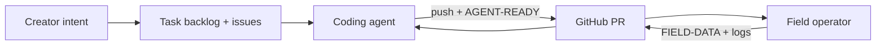

# Field Operator Onboarding

> Welcome to **GOD — Genesis of Digital Life**. You run the world on real hardware; the coding agent ships fixes; the creator sets intent. This doc is your map.

**Read first (30 min):**

1. [Ecology Hardening Manifesto](./74-ecology-hardening-manifesto.md) — harsh world, gated actions
2. [PR field test protocol](./78-pr-field-test-protocol.md) — how we coordinate via PR comments
3. [Git workflow](./83-git-workflow.md) — branches, protection, CI
4. [PROGRESS.md](../PROGRESS.md) — what is built vs in flight
5. [Task backlog](./82-project-task-backlog.md) — creator requests (nothing gets lost)

---

## Your role

| You do | You do not |
|--------|------------|
| Run Docker + Ollama on your machine | Push directly to `main` or `develop` |
| Pull, rebuild, test after `[AGENT-READY]` | Rebuild before `[AGENT-READY] @ <sha>` |
| Post `[FIELD-*]` reports **with runtime logs** | Commit API keys, `swarm.key`, wallet JSON, bulk agent dumps |
| Commit **handoff reports** on `field/*` branches | Commit `agent_data_full.json` or log captures |

---

## Machine requirements (honest)

| Resource | Minimum | Notes |
|----------|---------|-------|
| RAM | **16 GB** tight; **32 GB** comfortable | Ollama `llama3.1:8b` uses **~5–6 GB on the host**, not in Docker |
| GPU | RTX-class 8 GB+ VRAM | Or use `LLM_PROVIDER=stub` for observation-only |
| Disk | 20 GB free | Docker images + IPFS volumes |
| OS | Linux, macOS, or Windows + WSL2 | Docker Desktop on Windows adds ~600 MB overhead |

See [host memory budget](./78-pr-field-test-protocol.md#host-memory-budget-16-gb-field-machines) if the machine feels like it “crashed” but containers show healthy.

---

## First-time setup

```bash
git clone https://github.com/ma-za-kpe/god.git
cd god
git checkout develop
git pull --rebase origin develop

cp .env.example .env.local    # edit locally — NEVER commit
bash scripts/bootstrap-dev.sh
python3 -m pre_commit run --all-files

# swarm.key: ask maintainer out-of-band or scripts/generate-swarm-key.py (local only)
docker compose up -d
curl -sf http://localhost:8888/health && echo OK

# Optional: seed genesis agents
docker exec god-runtime python -m src.seed_agents --count 8
```

Ollama on host:

```bash
ollama pull llama3.1:8b
# Tight RAM? use llama3.2:3b and set LLM_MODEL=llama3.2:3b in .env.local
```

---

## How we work (three parties)



| Tag | Who posts | Meaning |
|-----|-----------|---------|
| `[AGENT-READY] T-xxx @ <sha>` | Agent | Safe to `git pull` and rebuild |
| `[AGENT-REQUEST] T-xxx` | Agent | Need field data before next fix |
| `[FIELD-READY]` | You | Pulled @ sha, pre-commit passed, stack up |
| `[FIELD-DATA] T-xxx` | You | Metrics + logs (required) |
| `[FIELD-PASS]` / `[FIELD-FAIL]` | You | Test outcome |

**Golden rules:**

1. **`git fetch` + `git pull --rebase` before every push or rebuild**
2. **`git checkout <correct-branch>` before any edit** — never commit on the wrong branch (check PR base branch first)
3. **`python3 -m pre_commit run --all-files` after every pull**
4. **Never rebuild until `[AGENT-READY]` matches your `git rev-parse --short HEAD`**
5. **Logs in every `[FIELD-*]` report** — see [metrics block](./78-pr-field-test-protocol.md#metrics--logs-in-every-field--report)
6. **Watch PR comments** — the coding agent coordinates through GitHub PR threads, not side channels. Subscribe to notification on active PRs; reply with `[FIELD-*]` tags when asked.

**No extra sync rituals.** Creator sets intent → agent posts on PR → you pull, test, comment. That is the loop.

---

## Handoff: “where did you stop?”

When joining mid-incident (crash, lag, unknown state), **commit and push a snapshot** so the coding agent can assess without guessing.

### Step 1 — Branch from your current state

```bash
git fetch origin
git checkout -b field/YOUR_GITHUB_USER/handoff-$(date +%Y%m%d)
```

Use your GitHub username. If you were on a feature branch, branch from there — do not lose local work.

### Step 2 — Fill the status report

Copy the template and fill every section:

```bash
cp docs/templates/FIELD_STATUS_REPORT.md field-reports/YOUR_GITHUB_USER-$(date +%Y%m%d).md
# edit the file — paste command outputs, do not paraphrase
```

### Step 3 — Commit only safe artifacts

**OK to commit:** filled `field-reports/*.md`, small config notes (no secrets).

**Never commit:** `.env.local`, `swarm.key`, `data/agent_wallets.json`, `*_full.json`, raw log files >100 KB.

```bash
python3 -m pre_commit run --all-files
bash scripts/security-audit.sh
git add field-reports/YOUR_GITHUB_USER-*.md
git commit -m "field(YOUR_GITHUB_USER): handoff status report YYYY-MM-DD"
git pull --rebase origin develop   # or merge base you branched from
git push -u origin field/YOUR_GITHUB_USER/handoff-YYYYMMDD
gh pr create --base develop --title "field(YOUR_GITHUB_USER): handoff status YYYY-MM-DD" \
  --body "See field-reports/…. Closes onboarding checklist on PR #N."
```

### Step 4 — Comment on the onboarding PR

Post:

```
[FIELD-HANDOFF]
Branch: field/YOUR_GITHUB_USER/handoff-YYYYMMDD @ <sha>
Report: field-reports/YOUR_GITHUB_USER-YYYYMMDD.md
Summary: <one sentence — running / crashed / lag / never started>
```

---

## Daily operator loop

```bash
git fetch origin
git checkout develop                 # or branch named in the active PR
git pull --rebase origin develop
python3 -m pre_commit run --all-files
# read PR comments — wait for [AGENT-READY] on the task PR
git rev-parse --short HEAD          # must match AGENT-READY sha
docker compose build runtime
docker compose up -d
docker compose logs runtime --tail 200   # always capture for [FIELD-DATA]
# post [FIELD-DATA] on the same PR thread
```

**Branch discipline:** if a PR says base `feat/foo`, branch your handoff from that branch — not `main`, not a stale local branch.

---

## Security

- [SECURITY.md](../SECURITY.md) — no keys in git, ever
- `bash scripts/security-audit.sh` before push
- Report suspected malicious commits via GitHub issue — do not paste keys in issues

---

## Who to ping

| Question | Channel |
|----------|---------|
| “What should I test?” | PR comment `[FIELD-QUESTION]` or GitHub issue |
| “Machine OOM / lag” | `[FIELD-DATA]` + host RAM stats (doc 78 memory section) |
| “Branch / merge confusion” | This doc + [doc 83](./83-git-workflow.md) |
| Priority shifts | Creator in chat; agent updates backlog |

---

## Checklist (mark in your handoff PR)

- [ ] Cloned repo and on `develop` (or documented other branch)
- [ ] `docker compose ps` — which services up/down
- [ ] `curl localhost:8888/health` result
- [ ] Ollama: model loaded? RSS?
- [ ] Host RAM free / total
- [ ] `field-reports/YOUR_USER-*.md` committed and pushed
- [ ] Commented `[FIELD-HANDOFF]` on onboarding PR
